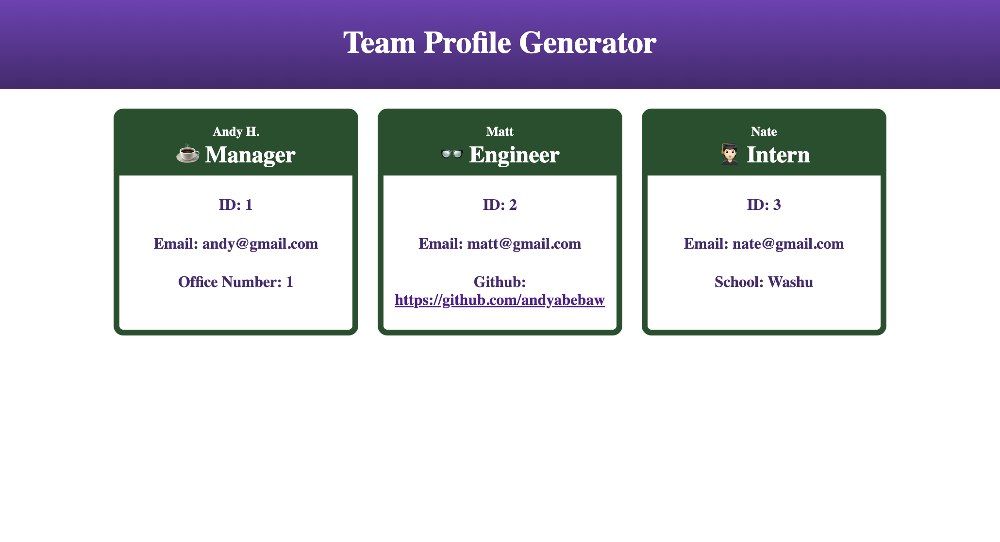

# TeamProfileGenerator

## Video Link
https://drive.google.com/file/d/1IydR5ZNsBwcm0BRoCrlSHeES6Lm55QuI/view?usp=sharing

## Description

This app allows you to generate a team profile page with cards for each of the employees

## Table of Contents (Optional)

- [Installation](#installation)
- [Usage](#usage)
- [Features](#features)

## Installation

1. Go To https://github.com/andyabebaw/TeamProfileGenerator
2. Copy the Git clone link using SSH.
3. In terminal on your local device, clone the repository using Git clone.
4. Open in Visual Studio.

## Usage

This website can be used to look at profiles for each of a teams employees.

## Required Features

GIVEN a command-line application that accepts user input

WHEN I am prompted for my team members and their information
THEN an HTML file is generated that displays a nicely formatted team roster based on user input

WHEN I click on an email address in the HTML
THEN my default email program opens and populates the TO field of the email with the address

WHEN I click on the GitHub username
THEN that GitHub profile opens in a new tab

WHEN I start the application
THEN I am prompted to enter the team manager’s name, employee ID, email address, and office number

WHEN I enter the team manager’s name, employee ID, email address, and office number
THEN I am presented with a menu with the option to add an engineer or an intern or to finish building my team

WHEN I select the engineer option
THEN I am prompted to enter the engineer’s name, ID, email, and GitHub username, and I am taken back to the menu

WHEN I select the intern option
THEN I am prompted to enter the intern’s name, ID, email, and school, and I am taken back to the menu

WHEN I decide to finish building my team
THEN I exit the application, and the HTML is generated

## How to Contribute

Follow the Installation Instructions above or click here: [Installation](#installation)
Make changes to index.html to add, remove, or change sections.  Edit the style.css to change the website appearance.  Also free to add new images in the images in images folder to be used on the site.
